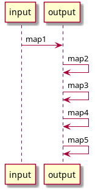
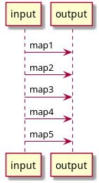

If you want to embed the library in your service, here's a short guide on how to use its internal API.

## Hello world

Here's a simple Java "hello world":

    import io.idml.ptolemy.*;

    public class JavaExample {
        public static void main(String[] args) {

            // Initialize the runtime. You only need one of these per application
            Ptolemy ptolemy = new Ptolemy();

            // Parse a simple mapping that turns
            PtolemyMapping mapping = ptolemy.fromString("x = a.b.int()");

            // Parse some json data taken from a string
            PtolemyValue input = PtolemyJson.parse("{\"a\": {\"b\": \"123\"}}");

            // Run a mapping
            PtolemyValue output = mapping.run(input);

            // Pretty-print the output as json
            System.out.println(PtolemyJson.pretty(output));
        }
    }

## Initialization

The Ptolemy object is the main execution context of the system. It acts as a factory for all other objects and can safely be shared between threads.

    Ptolemy ptolemy = new Ptolemy();

## Working with data

The PtolemyVaue class wraps some queryable data. Right now it supports JSON using Jackson and XML using JSoup.

    PtolemyValue input = PtolemyJson.parse("{\"a\": {\"b\": \"123\"}}");

Basic transformations can be performed on the object itself, but usually this isn't necessary

    PtolemyValue result = input.get("a").get("b").bool();

## Mappings

You can create a mapping from a string or use one of the built-in resolvers which will allow you to load from an embedded JAR resource or from the local filesystem.

    PtolemyMapping a = ptolemy.fromString("x = b");
    PtolemyMapping b = ptolemy.loadResource("my-mapping.ini");
    PtolemyMapping c = ptolemy.loadFile("my-mapping.ini");
    PtolemyValue output = mapping.run(input);

## Chains

A chain is a way of composing mappings so that the results of one mapping are transformed into the next, allowing you to split your mapping up into smaller pieces.

This use case evolved from the interation data model at DataSift where we have raw data, for example, Twitter, a sanitized version of that data, and then generalized:

    PtolemyChain facebookMapping = ptolemy.newChain(
        // Normalization: The text body of Facebook posts varies depending on whether it's a story, video, etc.
        ptolemy.fromString("facebook.content = this.(text | story | message).string()"),

        // Generalization: interaction.content refers to the body in all types.. Facebook, Twitter, Sina, etc.
        ptolemy.fromString("interaction.content = facebook.content.stripTags()"),

        // Validation: This schema validation is shared by all mappings to make sure that we follow uniform rules
        ptolemy.fromString("interaction.content : string().default(\"Aw damn, there's no tex on this one!\")")
    );
    // A simplified version of data received from the Facebook Graph API
    PtolemyValue facebookPost = PtolemyJson.parse("{\"message\": \"Some message\"}");
    // Chains can be run just like any other mapping
    PtolemyValue output = facebookMapping.run(facebookPost);

## Mapping Merges

As an alternative to chains, merges allow you to run multiple mappings against the same input data, then merge the output in order.

This allows you to write parallel mappings rather than mappings which are applied end to end.

    // Initialize the runtime. You only need one of these per application
    Ptolemy ptolemy = new Ptolemy();

    // Merge some mappings together into one mapping
    Mapping merged = PtolemyMapping.fromMultipleMappings(ptolemy, Arrays.asList(
            ptolemy.fromString("interaction.content = text"),
            ptolemy.fromString("interaction.author = author"),
            ptolemy.fromString("interaction.content = real_text")
    ));

    PtolemyValue input = PtolemyJson.parse(
            "{\"text\": \"an example body\", \"author\": \"bob\", \"real_text\": \"an alternate body\"}"
    );

    System.out.println(PtolemyJson.pretty(merged.run(input)));

